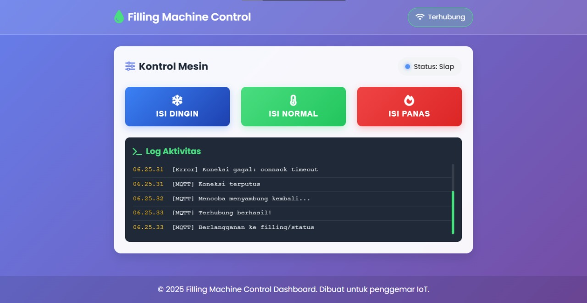
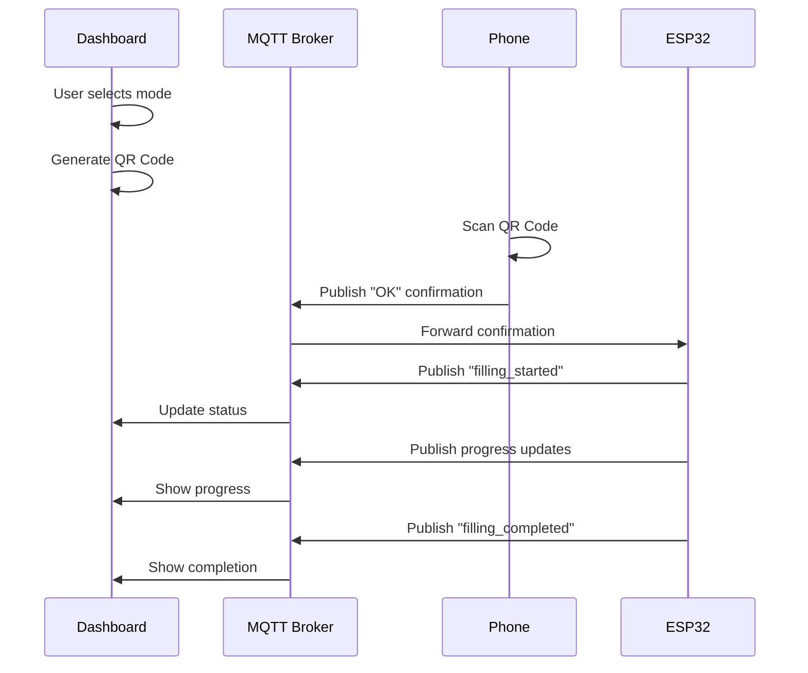

<h1 align="center">🚰 FILLING MACHINE WEB CONTROL</h1>

<p align="center">
  
</p>

<p align="center">
  <em>Secure, Interactive, and Smart Water Filling System with ESP32 & MQTT</em>
</p>

<p align="center">
  
  
  
  
  
  <a href="https://github.com/ficrammanifur/Filling-Machine-Web-Control/blob/main/LICENSE">
    
  </a>
</p>

---

## 📑 Table of Contents

- [✨ Overview](#-overview)
- [🔧 Features](#-features)
- [🏗️ System Architecture](#️-system-architecture)
- [📁 Project Structure](#-project-structure)
- [⚙️ Installation](#️-installation)
- [🚀 Usage](#-usage)
- [🧪 Testing](#-testing)
- [📦 Dependencies](#-dependencies)
- [🔧 Configuration](#-configuration)
- [🐞 Troubleshooting](#-troubleshooting)
- [🤝 Contributing](#-contributing)
- [📄 License](#-license)

---

## ✨ Overview

**Filling Machine Web Control** adalah sistem kontrol mesin pengisian air modern yang menggunakan ESP32 dan MQTT untuk komunikasi real-time. Sistem ini menggabungkan keamanan QR code dengan antarmuka web yang responsif.

### 🎯 Cara Kerja
1. **Pilih Mode** → Dashboard menampilkan pilihan (dingin, normal, panas)
2. **QR Code Muncul** → Sistem generate QR code untuk konfirmasi
3. **Scan & Konfirmasi** → Pengguna scan dengan smartphone
4. **Eksekusi Aman** → Mesin mulai mengisi setelah konfirmasi

**Keunggulan:** Perintah hanya dieksekusi setelah konfirmasi pengguna, menambah lapisan keamanan dan interaktivitas.

---

## 🔧 Features

- ✅ **Dashboard User-Friendly**  
  Interface modern untuk monitoring status dan pemilihan mode

- ✅ **QR Code Security**  
  Konfirmasi aman melalui scan QR code sebelum eksekusi

- ✅ **Real-time Updates**  
  Monitoring progress dan status changes secara langsung

- ✅ **Responsive Design**  
  Optimized untuk desktop dan mobile devices

- ✅ **Auto-Reconnect**  
  Koneksi MQTT otomatis reconnect jika terputus

- ✅ **Multi-Mode Support**  
  Mendukung 3 mode: Dingin, Normal, dan Panas

---

## 🏗️ System Architecture

### 🔗 Diagram Sistem

```text
┌─────────────────┐    MQTT     ┌─────────────────┐    WiFi    ┌─────────────────┐
│   Web Dashboard │ ◄─────────► │   MQTT Broker   │ ◄────────► │      ESP32      │
│   (index.html)  │             │  (HiveMQ/EMQX)  │            │(Filling Machine)│
└─────────────────┘             └─────────────────┘            └─────────────────┘
         │                                                               │
         │ QR Code                                                       │
         ▼                                                               ▼
┌─────────────────┐                                            ┌─────────────────┐
│ Mobile Confirm  │                                            │   Water Pump    │
│ (confirm.html)  │                                            │   & Sensors     │
└─────────────────┘                                            └─────────────────┘
```

### 📊 Message Flow



---

## 📁 Project Structure

```text
Filling-Machine-Web-Control/
├── 📄 index.html          # Main dashboard interface
├── 📄 confirm.html        # Mobile confirmation page
├── 📜 main.js            # Dashboard logic & MQTT handling
├── 📜 confirm.js         # Confirmation page logic
├── 🎨 style.css          # Responsive styling
├── 🖼️ assets/
│   ├── dingin.gif        # QR code for cold water
│   ├── normal.gif        # QR code for normal water
│   └── panas.gif         # QR code for hot water
├── 📋 esp32/
│   └── filling_machine.ino  # ESP32 Arduino code
└── 📖 README.md          # Project documentation
```

---

## ⚙️ Installation

### 1. 🔍 Clone Repository

```bash
git clone https://github.com/ficrammanifur/Filling-Machine-Web-Control.git
cd Filling-Machine-Web-Control
```

### 2. 🛠️ Generate QR Codes

#### Option A: Using Online Generator (TEC-IT)
1. Visit [TEC-IT Barcode Generator](https://barcode.tec-it.com/en)
2. Select QR Code type
3. Generate codes for each URL:

```text
Cold:   https://yourdomain.com/confirm.html?cmd=dingin
Normal: https://yourdomain.com/confirm.html?cmd=normal
Hot:    https://yourdomain.com/confirm.html?cmd=panas
```

#### Option B: Using CLI (qrencode)

```bash
# Install qrencode
sudo apt-get install qrencode  # Ubuntu/Debian
brew install qrencode          # macOS

# Generate QR codes
qrencode -o assets/dingin.gif "https://yourdomain.com/confirm.html?cmd=dingin"
qrencode -o assets/normal.gif "https://yourdomain.com/confirm.html?cmd=normal"
qrencode -o assets/panas.gif "https://yourdomain.com/confirm.html?cmd=panas"
```

### 3. 🌐 Deploy Web Interface

#### Option A: GitHub Pages

```bash
git add .
git commit -m "Initial setup"
git push origin main
```

1. Go to repository Settings
2. Navigate to Pages section
3. Select Source: Deploy from branch
4. Choose branch: main, folder: / (root)
5. Save and wait for deployment

**Access URL:** `https://yourusername.github.io/Filling-Machine-Web-Control`

#### Option B: Local Development Server

```bash
# Using Python
python -m http.server 8080

# Using Node.js http-server
npm install -g http-server
http-server . -p 8080

# Using PHP
php -S localhost:8080
```

**Access URL:** `http://localhost:8080`

### 4. 🤖 Configure ESP32

1. Open `esp32/filling_machine.ino` in Arduino IDE
2. Install required libraries:
   - WiFi
   - PubSubClient
   - ArduinoJson

3. Update configuration:

```cpp
// WiFi Configuration
const char* ssid = "YOUR_WIFI_SSID";
const char* password = "YOUR_WIFI_PASSWORD";

// MQTT Configuration
const char* mqtt_server = "broker.hivemq.com";
const int mqtt_port = 1883;
const char* mqtt_user = ""; // Leave empty for public broker
const char* mqtt_password = "";
```

4. Upload to ESP32

---

## 🚀 Usage

### 📱 Step-by-Step Operation

1. **🌐 Open Dashboard**
   ```
   Access: https://yourdomain.com/index.html
   ```

2. **🎯 Select Mode**
   - Click "Dingin" (Cold), "Normal", or "Panas" (Hot)
   - QR code modal will appear

3. **📱 Scan QR Code**
   - Use smartphone camera or QR scanner app
   - Opens confirmation page automatically

4. **✅ Confirm Action**
   - Tap "Konfirmasi" button on phone
   - System sends "OK" via MQTT

5. **🚰 Monitor Progress**
   - Dashboard shows real-time status
   - Progress bar indicates filling percentage
   - Completion notification appears

6. **❌ Cancel if Needed**
   - Click "Batal" to cancel operation
   - Close modal to abort

### 🔄 Status Messages

| Status | Description |
|--------|-------------|
| `idle` | System ready, waiting for command |
| `waiting_confirmation` | QR code displayed, waiting for scan |
| `filling_started` | Filling process initiated |
| `progress:XX%` | Filling progress (0-100%) |
| `filling_completed` | Process completed successfully |
| `error` | System error occurred |

---

## 🧪 Testing

### ✅ Pre-deployment Checklist

- [ ] Dashboard buttons show correct QR codes
- [ ] QR codes open correct confirmation URLs
- [ ] MQTT connection established successfully
- [ ] ESP32 receives and processes commands
- [ ] Status updates appear in real-time
- [ ] Mobile confirmation page works properly
- [ ] Cancel functionality works correctly

### 🔍 Testing Procedures

#### 1. **QR Code Validation**
```bash
# Test QR code URLs manually
curl "https://yourdomain.com/confirm.html?cmd=dingin"
curl "https://yourdomain.com/confirm.html?cmd=normal"
curl "https://yourdomain.com/confirm.html?cmd=panas"
```

#### 2. **MQTT Communication Test**
```bash
# Subscribe to topics (using mosquitto client)
mosquitto_sub -h broker.hivemq.com -t "filling/perintah"
mosquitto_sub -h broker.hivemq.com -t "filling/confirm"
mosquitto_sub -h broker.hivemq.com -t "filling/status"

# Publish test messages
mosquitto_pub -h broker.hivemq.com -t "filling/confirm" -m "OK"
```

#### 3. **Local Network Testing**
- Keep laptop and phone on same WiFi network
- Use local IP address in QR codes for testing
- Monitor browser console for errors

---

## 📦 Dependencies

### 🌐 Frontend Dependencies
- **MQTT.js** - MQTT client for web browsers
- **Font Awesome** - Icon library
- **Google Fonts (Poppins)** - Typography

### 🤖 ESP32 Dependencies
- **WiFi** - ESP32 WiFi connectivity
- **PubSubClient** - MQTT client library
- **ArduinoJson** - JSON parsing library

### 🛠️ Development Tools
- **qrencode** - QR code generation (optional)
- **http-server** - Local development server (optional)

---

## 🔧 Configuration

### 🌐 Web Configuration

Edit `main.js` and `confirm.js`:

```javascript
// MQTT Broker Settings
const MQTT_BROKER = 'wss://broker.hivemq.com:8884/mqtt';
const MQTT_OPTIONS = {
    keepalive: 60,
    clientId: 'filling_machine_' + Math.random().toString(16).substr(2, 8),
    protocolId: 'MQTT',
    protocolVersion: 4,
    clean: true,
    reconnectPeriod: 1000,
    connectTimeout: 30 * 1000
};

// MQTT Topics
const TOPICS = {
    COMMAND: 'filling/perintah',
    CONFIRM: 'filling/confirm',
    STATUS: 'filling/status'
};
```

### 🤖 ESP32 Configuration

Edit `esp32/filling_machine.ino`:

```cpp
// Pin Configuration
#define PUMP_PIN 2
#define SENSOR_PIN 4
#define LED_PIN 5

// Timing Configuration
#define FILLING_TIMEOUT 30000  // 30 seconds max
#define STATUS_UPDATE_INTERVAL 1000  // 1 second

// MQTT Topics
const char* TOPIC_COMMAND = "filling/perintah";
const char* TOPIC_CONFIRM = "filling/confirm";
const char* TOPIC_STATUS = "filling/status";
```

---

## 🐞 Troubleshooting

### ❌ Common Issues & Solutions

#### **QR Code tidak muncul**
- ✅ Periksa path file GIF di `assets/` folder
- ✅ Pastikan QR code sudah di-generate dengan benar
- ✅ Cek browser console untuk error loading image

#### **MQTT Connection Failed**
```javascript
// Check browser console for errors
console.log('MQTT connection status:', client.connected);

// Try alternative brokers
const BACKUP_BROKERS = [
    'wss://broker.emqx.io:8084/mqtt',
    'wss://test.mosquitto.org:8081'
];
```

#### **ESP32 tidak menerima perintah**
- ✅ Periksa koneksi WiFi ESP32
- ✅ Pastikan MQTT broker sama dengan web interface
- ✅ Cek Serial Monitor untuk debug messages
- ✅ Verify topic names match exactly

#### **Mobile confirmation tidak bekerja**
- ✅ Pastikan smartphone terhubung internet
- ✅ Test URL confirmation page secara manual
- ✅ Periksa CORS settings jika menggunakan custom domain

#### **Status tidak update real-time**
```javascript
// Add connection monitoring
client.on('connect', () => {
    console.log('MQTT Connected');
    updateConnectionStatus(true);
});

client.on('disconnect', () => {
    console.log('MQTT Disconnected');
    updateConnectionStatus(false);
});
```

### 🔍 Debug Mode

Enable debug logging:

```javascript
// Add to main.js
const DEBUG = true;

function debugLog(message, data = null) {
    if (DEBUG) {
        console.log(`[DEBUG] \${message}`, data);
    }
}
```

---

## 🤝 Contributing

Kontribusi sangat diterima! Silakan:

1. **Fork** repository ini
2. **Create** feature branch (`git checkout -b feature/AmazingFeature`)
3. **Commit** changes (`git commit -m 'Add some AmazingFeature'`)
4. **Push** to branch (`git push origin feature/AmazingFeature`)
5. **Open** Pull Request

### 📋 Development Guidelines

- Gunakan consistent code formatting
- Add comments untuk logic yang kompleks
- Test semua fitur sebelum submit PR
- Update dokumentasi jika diperlukan

### 🐛 Bug Reports

Gunakan GitHub Issues dengan template:

```markdown
**Bug Description:**
Brief description of the issue

**Steps to Reproduce:**
1. Step one
2. Step two
3. Step three

**Expected Behavior:**
What should happen

**Actual Behavior:**
What actually happens

**Environment:**
- Browser: Chrome/Firefox/Safari
- Device: Desktop/Mobile
- ESP32 Version: 
```

---

## 📄 License

Proyek ini dilisensikan di bawah [MIT License](LICENSE).

```text
MIT License

Copyright (c) 2024 Ficram Manifur

Permission is hereby granted, free of charge, to any person obtaining a copy
of this software and associated documentation files (the "Software"), to deal
in the Software without restriction, including without limitation the rights
to use, copy, modify, merge, publish, distribute, sublicense, and/or sell
copies of the Software, and to permit persons to whom the Software is
furnished to do so, subject to the following conditions:

The above copyright notice and this permission notice shall be included in all
copies or substantial portions of the Software.
```

---

## 🙏 Acknowledgments

- **HiveMQ** - Public MQTT broker untuk testing
- **TEC-IT** - QR Code generator service
- **Font Awesome** - Icon library
- **MQTT.js** - JavaScript MQTT client
- **ESP32 Community** - Arduino libraries dan examples

---

<div align="center">

**⚡ Built with ESP32, MQTT & Web Technologies**

**🚰 Making water filling systems smarter and safer**

**⭐ Star this repo if you like it!**

<p><a href="#top">⬆ Kembali ke Atas</a></p>

</div>
